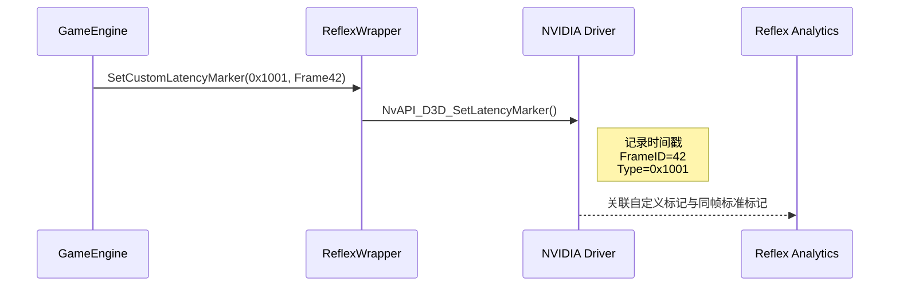

# UE5_Lyra学习指南_029_泽_04_SetCustomLatencyMarker 

本文章仅为小刚-B站课堂-虚幻引擎视频课程Lyra-精讲的演讲手稿.  
本套课程链接:[[UE5]虚幻引擎游戏案例Lyra精讲](https://www.bilibili.com/cheese/play/ss112001159)  
前置课程链接:[[UE5]虚幻引擎UEC++从基础到进阶](https://www.bilibili.com/cheese/play/ss28043)  

文章内容由小刚撰写,采用了以下多种方式:  
1.口述转文字  
2.AI重构  
3.参考引擎源码  
4.Lyra工程源码  
5.结合社区论坛各位大佬的解析  

- [UE5\_Lyra学习指南\_029\_泽\_04\_SetCustomLatencyMarker](#ue5_lyra学习指南_029_泽_04_setcustomlatencymarker)
  - [提问](#提问)
  - [解读](#解读)
    - [核心功能：自定义延迟标记](#核心功能自定义延迟标记)
    - [工作流程解析](#工作流程解析)
    - [关键差异点：`markerType` 处理](#关键差异点markertype-处理)
    - [典型使用场景](#典型使用场景)
    - [数据流向](#数据流向)
    - [为什么需要自定义标记？](#为什么需要自定义标记)
    - [注意事项](#注意事项)
    - [与标准标记的协同分析](#与标准标记的协同分析)
  - [总结](#总结)

## 提问
``` cpp
void FReflexLatencyMarkers::SetCustomLatencyMarker(uint32 MarkerId, uint64 FrameNumber)
{
	if (DisableLatencyMarkers == 0 && bEnabled && bFeatureSupport)
	{
		NvAPI_Status status = NVAPI_OK;
		NV_LATENCY_MARKER_PARAMS_V1 params = { 0 };
		params.version = NV_LATENCY_MARKER_PARAMS_VER1;
		params.frameID = FrameNumber;
		params.markerType = NV_LATENCY_MARKER_TYPE(MarkerId);

		status = NvAPI_D3D_SetLatencyMarker(static_cast<IUnknown*>(GDynamicRHI->RHIGetNativeDevice()), &params);
	}
}


```

## 解读
这段 `SetCustomLatencyMarker` 函数代码是 NVIDIA Reflex 延迟标记系统的扩展，允许设置**自定义延迟标记**。以下是详细解析：

### 核心功能：自定义延迟标记
1. **目的扩展性**：
   - 相比固定标记（如 `RENDERSUBMIT_END`），此函数允许开发者**自定义任意关键时间点**
   - 用于标记引擎/游戏特有的阶段（如物理模拟开始、AI决策结束等）
   - 扩展 Reflex 分析能力，覆盖非标准渲染管线阶段

2. **参数解析**：
   ```cpp
   void SetCustomLatencyMarker(uint32 MarkerId, uint64 FrameNumber)
   ```
   - `MarkerId`：**自定义标记类型的标识符**，由开发者定义
     - 值域通常需使用 NVIDIA 预留的自定义范围（如 `0x1000` 以上）
     - 示例：`1000`=物理开始, `1001`=物理结束
   - `FrameNumber`：帧编号（与标准标记保持一致的单调递增ID）

### 工作流程解析
```cpp
// 条件检查（与标准标记相同）
if (DisableLatencyMarkers == 0 && bEnabled && bFeatureSupport) 
{
    // 初始化参数结构体
    NV_LATENCY_MARKER_PARAMS_V1 params = { 0 };
    params.version = NV_LATENCY_MARKER_PARAMS_VER1;  // 版本标识
    params.frameID = FrameNumber;                   // 关键：绑定到当前帧
    
    // 核心差异点：使用自定义MarkerId
    params.markerType = NV_LATENCY_MARKER_TYPE(MarkerId);  // ✨

    // 调用NVIDIA API
    NvAPI_D3D_SetLatencyMarker(
        static_cast<IUnknown*>(GDynamicRHI->RHIGetNativeDevice()),
        &params
    );
}
```

### 关键差异点：`markerType` 处理
```cpp
params.markerType = NV_LATENCY_MARKER_TYPE(MarkerId); 
```
- **强类型转换**：将输入的 `uint32 MarkerId` 转换为 `NV_LATENCY_MARKER_TYPE` 枚举类型
- **自定义范围**：
  - NVIDIA 预定义标记（如 `RENDERSUBMIT_END=3`）通常使用 0~99
  - **自定义标记建议从 `0x1000` (4096) 开始**（需查阅 NVIDIA 文档确认）
  - 例如：
    ```cpp
    constexpr uint32 CUSTOM_PHYSICS_START = 0x1001;
    constexpr uint32 CUSTOM_AI_UPDATE_END = 0x1002;
    ```

### 典型使用场景
```cpp
// 在物理模拟开始时调用
SetCustomLatencyMarker(CUSTOM_PHYSICS_START, CurrentFrame);

// 执行物理模拟...
UpdatePhysicsSystem();

// 在物理模拟结束时调用
SetCustomLatencyMarker(CUSTOM_PHYSICS_END, CurrentFrame);
```

### 数据流向


### 为什么需要自定义标记？
1. **深度分析**：
   - 测量特定子系统（如物理/AI）对总延迟的贡献
   - 识别非渲染瓶颈（例：物理模拟耗时过长）

2. **引擎扩展**：
   - 标记UE5特有系统：Nanite/Lumen处理阶段
   - 跟踪Gameplay逻辑耗时

3. **高级优化**：
   ```mermaid
   pie
       title 延迟成分分析
       “渲染提交” ： 35
       “GPU渲染” ： 40
       “自定义物理” ： 25
   ```

### 注意事项
1. **ID管理**：
   - 需全局定义自定义ID常量避免冲突
   - 建议配合枚举类管理：
     ```cpp
     enum class EReflexCustomMarkers : uint32 {
         PhysicsStart = 0x1000,
         PhysicsEnd,
         AI_BehaviorUpdate
     };
     ```

2. **帧一致性**：
   - 同一逻辑事件的开始/结束标记**必须使用相同FrameNumber**
   - 错误示例：
     ```cpp
     SetCustomLatencyMarker(PHYSICS_START, Frame);  // 帧N
     //... 跨帧边界 ...
     SetCustomLatencyMarker(PHYSICS_END, Frame+1);  // 错误！帧N+1
     ```

3. **驱动支持**：
   - 需确认驱动支持自定义标记（较新版本）
   - 无效ID可能被静默忽略

### 与标准标记的协同分析
在 NVIDIA 分析工具（如 Reflex SDK 或 FrameView）中：
1. 自定义标记会与标准标记**在同一时间轴显示**
2. 可测量：
   - 从 `INPUT_SAMPLE` 到 `CUSTOM_AI_UPDATE` 的延迟
   - `CUSTOM_PHYSICS` 阶段自身耗时
   ```plaintext
   | Frame 42 | 
   |---INPUT_SAMPLE---[CUSTOM_AI_START]...[CUSTOM_AI_END]---RENDERSUBMIT_END---PRESENT---|
   ```

## 总结
这段代码实现了：
- NVIDIA Reflex 的 **自定义延迟标记** 能力
- 通过开放 `MarkerId` 参数实现**标记类型扩展**
- 使开发者能跟踪引擎/游戏特定阶段的延迟
- 需配合：
  - 严谨的标记ID管理
  - 精确的帧号同步
  - 支持自定义标记的NVIDIA工具链

主要用于深度性能分析，特别在复杂游戏引擎（如UE5）中优化非标准子系统时至关重要。

以上来自DeepSeek.